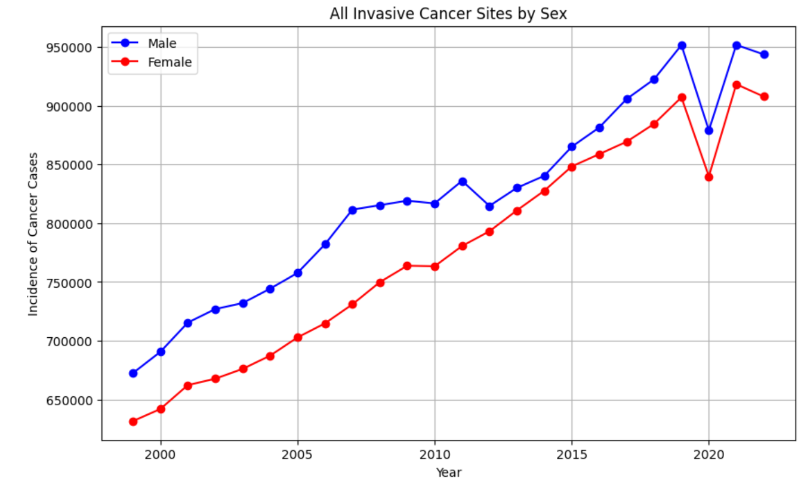
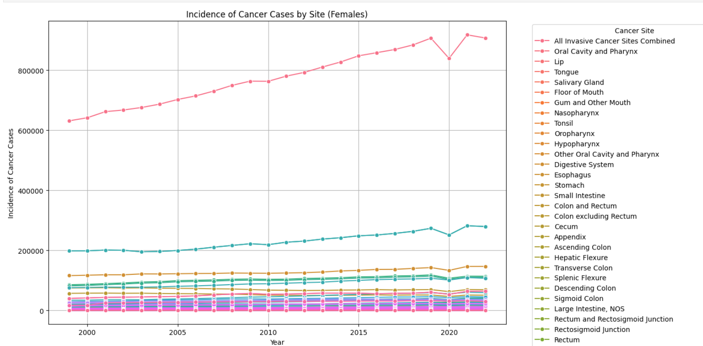
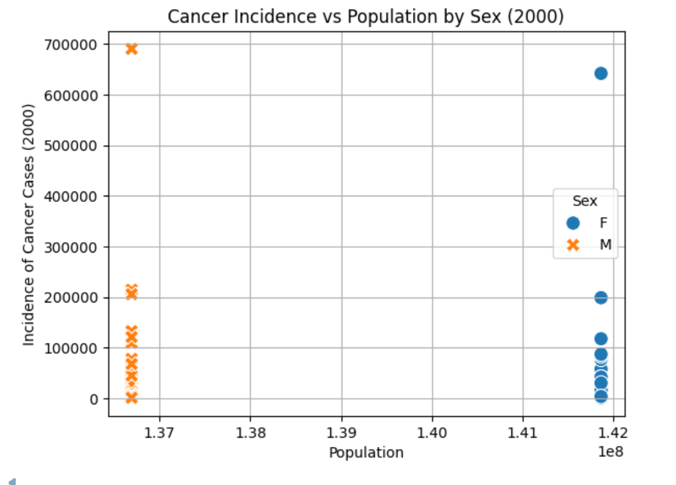
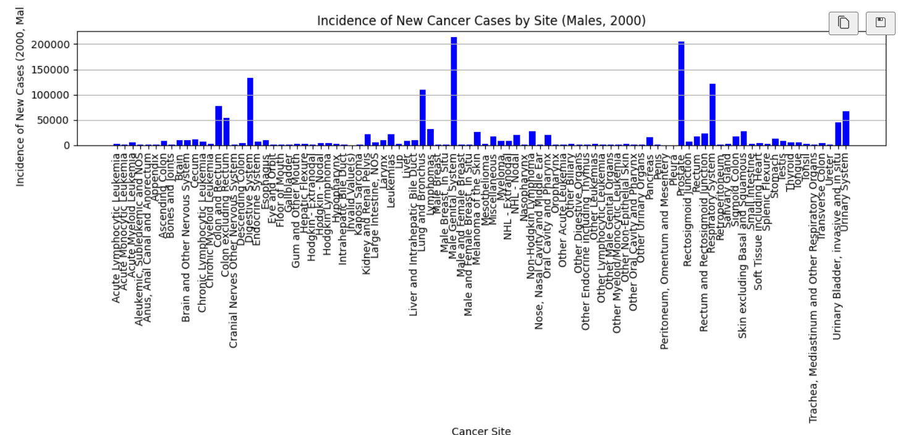
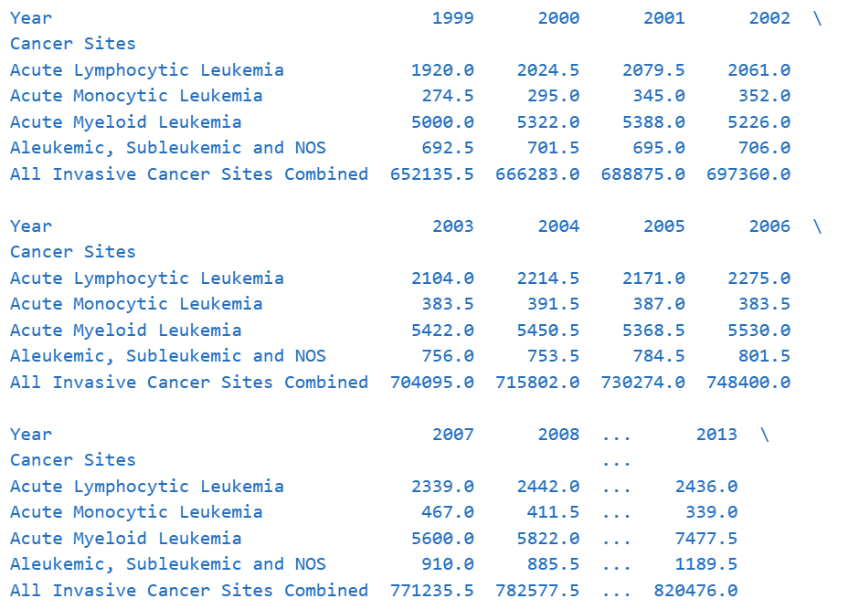

# Project Conclusions

This is a project that pulls from CDC data that has been cleaned. We utilize filter, groupby, and agg functions in order to draw conclusions from the data. 

2. My job was to determine which cancer site had the highest incidence of new cases for females in each year ranging from 1999-2022. The resulting data in the figure below displays that All Invasive Cancer Sites Combined has the highest incidence. However, if you adjust the code to exclude all sites combined, higest incidence would be for female breast cancer. The results tell us that every year ranging from 1999 to 2022, the highest incidence is for All Invasive Cancer Sites Combined.

      Year                        Cancer Sites   Count
4     1999  All Invasive Cancer Sites Combined  631741
102   2000  All Invasive Cancer Sites Combined  641968
200   2001  All Invasive Cancer Sites Combined  662313
298   2002  All Invasive Cancer Sites Combined  667753
396   2003  All Invasive Cancer Sites Combined  676099
494   2004  All Invasive Cancer Sites Combined  687327
592   2005  All Invasive Cancer Sites Combined  702854
690   2006  All Invasive Cancer Sites Combined  714800
788   2007  All Invasive Cancer Sites Combined  730953

3. I created  lineplot All Invasive Cancer Sites, and a separate line for Males and Females (two lines total). 

As seen from the results, we can actually gather a lot of conclusions based on the incidence relating to sex. There was a huge dip in cases in 2020 (we can infer that it could be due to the pandemic due to the year 2020, could be attributed to people not getting diagnosed at the time, not going to the hospital). But note that there is a steady rise in the incidence of cases throughout the years and that men always have a higher incidence of cancer cases compared to women.

4. For problem 4 I created a line plot for females noting their incidence and cancer site. 

The conclusions that can be drawn from the data, excluding all invasive cancer sites, is that female breast has the highest incidence, with cases steadily increasing but maintaining around the 20000 cases range. 

5. In problem 5, I created a scatter plot containing each (site, sex) pair in 2000, comparing population with the incidence of cancer.

The scatterplot shows us the males and females, and it actually gives us quite a bit of understanding. We understand that in the year 2000 there were more females than males, and that both sex's have a similar range of data. In that the data mainly lies near 200000 cases with the exception of two outliers above 600000 cases. It also tells us that even though there were more females in the population, males had a high number of cases. Which aligns with the data from previous graphs showing males have a higher incidence compared to women. 

6. In problem 6, I got a headache from the amount of bars and tiny lettering, but for the sake of the assignment I did my best. 

I created a bar plot based on males and the incidence of cancer in the year 2000, and we can conclude that males have the highest number of cases for male genital system, and more specifically, the prostate in 2000. The third highest incidence was for the digestive system. This tells us that the most common site for cancer in males in that year was genital specific areas. Note: this data is excluding all invasive cancer sites. 

7. In problem 7, I determined whether males or females had the highest incidence of cases each year and their respective cancer sites.

While the figure displays only a few rows, that is enough to gather the conclusion that males have the highest incidence of cases every year. Which tracks with our previous figures stating similarly. In fact, all around a conclusion can be drawn that men tend to be at a higher risk for cancer than woman.

8. In problem 8, I created a pivot table with a row for each cancer site, column for each year, and a value equal to the total incidence of males and females combined. 

The pivot tables displays an increase in cancer cases and most notably, a large amount of cases in acute lymphotic leukimia. Also notable is that while other cancer cites have increased or maintained around the same number of cases, Acute Monocytic Leukemia decreases in incidence every year, meaning a cure or treatment methods have gotten more effective as the years go by, or its just not being diagnosed as often for a reason. 
